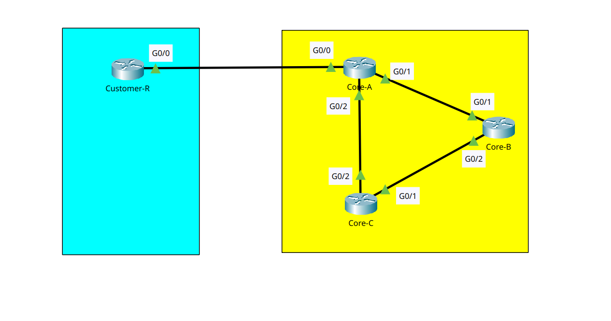

# 🌍 Dual-Stack ISP Backbone & BGP Edge Routing


## 📖 Executive Summary
This project simulates an enterprise-grade Internet Service Provider (ISP) backbone operating across three distinct routing domains. It demonstrates a **Dual-Stack (IPv4/IPv6)** core network utilizing EIGRP and OSPFv3, integrated with an external customer via **eBGP**. 

The primary objective was to successfully establish an end-to-end data plane across dissimilar routing protocols by implementing precise **Route Redistribution** and managing transition technologies like **GRE Tunneling**.

---

## 🏗️ Network Topology

*A high-availability triangular ISP core (Routers A, B, C) providing transit for an External Customer.*

### 🔧 Core Technologies Implemented
| Feature | Implementation | Purpose |
| :--- | :--- | :--- |
| **Interior Gateway Protocol (IPv4)** | **EIGRP AS 10** | Fast-converging internal routing for the ISP's IPv4 infrastructure. |
| **Interior Gateway Protocol (IPv6)** | **OSPFv3 Area 0** | Dedicated routing process for the ISP's IPv6 backbone. |
| **Exterior Gateway Protocol** | **eBGP (AS 100 & AS 65000)** | External peering between the ISP (Core-A) and the Customer Edge. |
| **Route Injection** | **Mutual Redistribution** | Translating external BGP customer routes into the internal EIGRP backbone. |
| **Overlay Networking** | **GRE Tunneling** | Creating a direct, logical P2P link between City A and City C. |

---

## 📊 IP Addressing Schema

| Device | Interface | IPv4 Address (EIGRP / BGP) | IPv6 Address (OSPFv3) | Connection |
| :--- | :--- | :--- | :--- | :--- |
| **Core-A (ISP Edge)** | `Loopback0` | `1.1.1.1/32` | `2001:DB8:1::1/128` | Router ID |
| | `Gig0/1` | `10.0.12.1/30` | `2001:DB8:12::1/64` | Link to Core-B |
| | `Gig0/2` | `10.0.13.1/30` | `2001:DB8:13::1/64` | Link to Core-C |
| | `Gig0/0` | `203.0.113.1/30` | `2001:DB8:C::1/64` | eBGP Link to Customer |
| | `Tunnel0` | `172.16.1.1/30` | `2001:DB8:AC::1/64` | GRE Tunnel to Core-C |
| **Core-B (ISP Core)** | `Loopback0` | `2.2.2.2/32` | `2001:DB8:2::2/128` | Router ID |
| | `Gig0/1` | `10.0.12.2/30` | `2001:DB8:12::2/64` | Link to Core-A |
| | `Gig0/2` | `10.0.23.1/30` | `2001:DB8:23::1/64` | Link to Core-C |
| **Core-C (ISP Core)**| `Loopback0` | `3.3.3.3/32` | *Unassigned* | Router ID |
| | `Gig0/1` | `10.0.23.2/30` | `2001:DB8:23::2/64` | Link to Core-B |
| | `Gig0/2` | `10.0.13.2/30` | `2001:DB8:13::2/64` | Link to Core-A |
| | `Tunnel0` | `172.16.1.2/30` | `2001:DB8:AC::2/64` | GRE Tunnel to Core-A |
| **Customer-R (Edge)** | `Gig0/0` | `203.0.113.2/30` | `2001:DB8:C::2/64` | Uplink to ISP Core-A |
| | `Loopback100` | `192.168.100.1/24` | *Unassigned* | Simulated Customer LAN |

---

## ⚙️ Key Configuration Snippets

### 1. eBGP Peering & Route Advertising (Customer-R)
The customer edge router connects to the ISP and advertises its internal private LAN (`192.168.100.0/24`) to the global routing table.
```bash
router bgp 65000
 bgp router-id 99.99.99.99
 neighbor 203.0.113.1 remote-as 100
 network 192.168.100.0 mask 255.255.255.0
```

### 2. Protocol Translation / Redistribution (Core-A)
Core-A acts as the Autonomous System Boundary Router (ASBR). It takes the customer routes learned via BGP and injects them into the ISP's EIGRP topology using seed metrics (Bandwidth, Delay, Reliability, Load, MTU).
```bash
router eigrp 10
 redistribute bgp 100 metric 10000 100 255 1 1500
 network 10.0.0.0
```

### 3. Asymmetric Routing Prevention (Customer-R)
To ensure returning ICMP/TCP traffic from the ISP's internal 10.x.x.x network can find its way back out of the customer network, a static default route was implemented pointing to the ISP gateway.
```bash
ip route 0.0.0.0 0.0.0.0 203.0.113.1
```

## 🧪 Verification & Testing

### Test Case 1: eBGP Adjacency
Objective: Verify the ISP and Customer routers have successfully formed a BGP neighbor relationship.
Result: Session state is Established, actively receiving prefixes.

### Test Case 2: Route Redistribution Validation
Objective: Ensure the internal ISP backbone (Core-C) learned the BGP customer route via EIGRP.
Result: The 192.168.100.0/24 network appears as an EIGRP External (D EX) route.

### Test Case 3: End-to-End Data Plane Test
Objective: Verify a packet can originate on the far side of the ISP core, traverse EIGRP, cross the BGP boundary, hit the customer LAN, and successfully return.
Result: Successful ICMP Echo Replies confirm 100% data-plane functionality.

## 💡 Real-World Troubleshooting & Engineering Challenges
During the simulation build, several technical roadblocks were encountered and systematically resolved:

### 🔴 Issue 1: "Blackholed" GRE Encapsulation
Symptom: GRE Tunnel interfaces showed as up/up when using virtual loopbacks as the tunnel source, but ICMP traffic was silently dropped.

Root Cause: A known Packet Tracer limitation regarding recursive routing and loopback anchoring for GRE headers.

Solution: Re-anchored the tunnel source and tunnel destination directly to the physical GigabitEthernet hardware IPs, bypassing the simulator's encapsulation bug.

### 🔴 Issue 2: One-Way Connectivity (Missing Return Route)
Symptom: Core-C could successfully route an ICMP Echo Request to the Customer LAN (192.168.100.1), but pings still failed (.....).

Root Cause: The ICMP Echo Reply arrived at the Customer router, but the Customer had no routing table entries for the ISP's internal 10.x.x.x subnets, causing the router to drop the return packet.

Solution: Engineered a standard edge-network fix by deploying a static Gateway of Last Resort (ip route 0.0.0.0 0.0.0.0 203.0.113.1) on the Customer router to forward all unknown traffic back to the ISP.

### 🔴 Issue 3: Cisco 2911 MP-BGP Limitations
Symptom: The address-family ipv6 command was completely rejected inside the BGP router configuration mode.

Root Cause: The specific Cisco 2911 IOS 15.1 image provided in Packet Tracer lacks support for Multiprotocol BGP (MP-BGP).

Solution: Adapted the architecture to use standard IPv4 eBGP for edge routing while maintaining an OSPFv3 dual-stack core, simulating an IPv4-over-IPv6 backbone transition.

